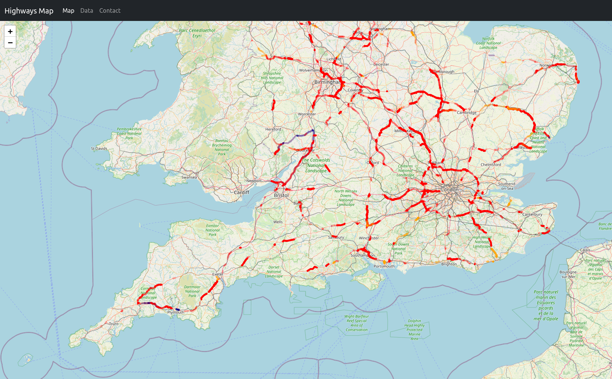

# Highways Map
Simple app to fetch the road closure information from the Highways Agency API and map it. Use some simple colours and opacities to differentiate cause and severity.



# Run

## Docker
```bash
read -sp "API KEY: " SUBSCRIPTION_KEY
echo "SUBSCRIPTION_KEY=$SUBSCRIPTION_KEY" > .env
docker run --name highways-map --detach --tty --env-file=.env --publish 5000:5000 ghcr.io/pwcazenave/highways-map:main
```

Open http://localhost:5000/map in your browser to view the road closures.